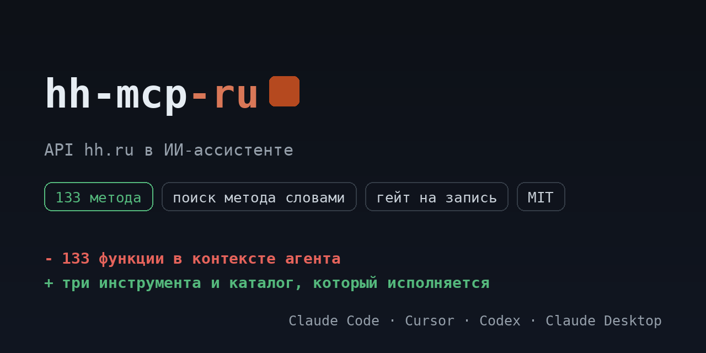

# hh-mcp-ru

<!-- mcp-name: io.github.ilyautov/hh-mcp-ru -->

API hh.ru для ИИ-ассистентов: вакансии, отклики и приглашения, резюме, справочники, статистика зарплат. Каталог из официальной спеки, у каждого метода класс доступа.

[](https://pypi.org/project/hh-mcp-ru/)
[](https://github.com/ilyautov/hh-mcp-ru/actions/workflows/ci.yml)
[](LICENSE)
[](#карта-методов)
[](https://business-mcp-ru.aifrontier.tech/hh-api.html)
[](https://github.com/ilyautov/hh-mcp-ru/stargazers)

[](https://vscode.dev/redirect/mcp/install?name=hh&config=%7B%22command%22%3A%20%22uvx%22%2C%20%22args%22%3A%20%5B%22hh-mcp-ru%22%5D%2C%20%22env%22%3A%20%7B%22HH_TOKEN%22%3A%20%22%24%7Binput%3Ahh_token%7D%22%2C%20%22HH_APP_NAME%22%3A%20%22%24%7Binput%3Ahh_app_name%7D%22%7D%7D&inputs=%5B%7B%22id%22%3A%20%22hh_token%22%2C%20%22type%22%3A%20%22promptString%22%2C%20%22description%22%3A%20%22%D0%A2%D0%BE%D0%BA%D0%B5%D0%BD%20%D0%BF%D1%80%D0%B8%D0%BB%D0%BE%D0%B6%D0%B5%D0%BD%D0%B8%D1%8F%20hh.ru%20%28dev.hh.ru%20%E2%86%92%20%D0%9C%D0%BE%D0%B8%20%D0%BF%D1%80%D0%B8%D0%BB%D0%BE%D0%B6%D0%B5%D0%BD%D0%B8%D1%8F%29.%22%2C%20%22password%22%3A%20true%7D%2C%20%7B%22id%22%3A%20%22hh_app_name%22%2C%20%22type%22%3A%20%22promptString%22%2C%20%22description%22%3A%20%22%D0%98%D0%BC%D1%8F%20%D0%BF%D1%80%D0%B8%D0%BB%D0%BE%D0%B6%D0%B5%D0%BD%D0%B8%D1%8F%20%D0%B8%20%D0%BA%D0%BE%D0%BD%D1%82%D0%B0%D0%BA%D1%82%D0%BD%D1%8B%D0%B9%20email%20%D0%B4%D0%BB%D1%8F%20%D0%B7%D0%B0%D0%B3%D0%BE%D0%BB%D0%BE%D0%B2%D0%BA%D0%B0%20HH-User-Agent%3A%20%D0%B1%D0%B5%D0%B7%20%D0%BD%D0%B5%D0%B3%D0%BE%20hh%20%D0%BE%D1%82%D0%BA%D0%BB%D0%BE%D0%BD%D1%8F%D0%B5%D1%82%20%D0%B7%D0%B0%D0%BF%D1%80%D0%BE%D1%81%D1%8B.%22%7D%5D)
[](https://cursor.com/en/install-mcp?name=hh&config=eyJjb21tYW5kIjogInV2eCIsICJhcmdzIjogWyJoaC1tY3AtcnUiXSwgImVudiI6IHsiSEhfVE9LRU4iOiAiIiwgIkhIX0FQUF9OQU1FIjogIiJ9fQ==)

<p align="center">
  <a href="https://business-mcp-ru.aifrontier.tech/">
    
  </a>
</p>

Каталог собран из первоисточника (официальная спека `api.hh.ru/openapi/specification/public`) и лежит в репозитории как
`hh_mcp/endpoints.yaml`: **133 метода**, из них 92 на чтение,
32 на запись и 9 необратимых. Сервер исполняет ровно этот файл,
поэтому таблица ниже не может разойтись с кодом.

## Установка

```bash
uvx hh-mcp-ru
```

Claude Desktop, `claude_desktop_config.json`:

```json
{
  "mcpServers": {
    "hh-mcp": {
      "command": "uvx",
      "args": ["hh-mcp-ru"],
      "env": { "HH_TOKEN": "...", "HH_APP_NAME": "..." }
    }
  }
}
```

## Ключи

dev.hh.ru → Мои приложения → создать приложение → access token. `HH_APP_NAME` заполняется обязательно: hh отклоняет запросы без внятного User-Agent, и это первая причина непонятных ошибок 400.

| переменная | секрет | что это |
|---|---|---|
| `HH_TOKEN` | да | Токен приложения hh.ru (dev.hh.ru → Мои приложения). |
| `HH_APP_NAME` | нет | Имя приложения и контактный email для заголовка HH-User-Agent: без него hh отклоняет запросы. |

Ключи можно не держать в окружении: сервер умеет кабинеты и кладёт их в
`~/.ru-mcp/cabinets.json` с правами 600, вне репозитория.

## Карта методов

| раздел | методов | чтение | запись | необратимое |
|---|---|---|---|---|
| Работодатель и менеджеры | 30 | 23 | 5 | 2 |
| Вакансии | 21 | 12 | 7 | 2 |
| Общие справочники | 14 | 6 | 7 | 1 |
| Подсказки | 11 | 11 | 0 | 0 |
| Отклики и приглашения | 10 | 5 | 5 | 0 |
| Сохранённые поиски | 6 | 2 | 3 | 1 |
| Статистика зарплат | 5 | 5 | 0 | 0 |
| Вебхуки | 4 | 1 | 2 | 1 |
| Комментарии к соискателю | 4 | 1 | 2 | 1 |
| Резюме | 3 | 3 | 0 | 0 |
| Звонки | 3 | 3 | 0 | 0 |
| Регионы | 3 | 3 | 0 | 0 |
| Токены | 2 | 0 | 1 | 1 |
| Учебные заведения | 2 | 2 | 0 | 0 |
| Локали | 2 | 2 | 0 | 0 |
| Метро | 2 | 2 | 0 | 0 |
| Текущий пользователь | 1 | 1 | 0 | 0 |
| Аккаунты менеджеров | 1 | 1 | 0 | 0 |
| Отрасли | 1 | 1 | 0 | 0 |
| Словари | 1 | 1 | 0 | 0 |
| Профессиональные роли | 1 | 1 | 0 | 0 |
| Языки | 1 | 1 | 0 | 0 |
| Навыки | 1 | 1 | 0 | 0 |
| Clickme | 1 | 1 | 0 | 0 |
| Районы | 1 | 1 | 0 | 0 |
| Шаблоны сообщений | 1 | 1 | 0 | 0 |
| Условия публикации вакансий | 1 | 1 | 0 | 0 |
| **всего** | **133** | **92** | **32** | **9** |

## Как это выглядит в чате

Вы: поиск вакансий

```
hh_search_methods("поиск вакансий")
  hh_get_vacancies                     GET  /vacancies                                 чтение
  hh_get_vacancies_related_to_vacancy  GET  /vacancies/{vacancy_id}/related_vacancies  чтение
  hh_get_vacancies_similar_to_vacancy  GET  /vacancies/{vacancy_id}/similar_vacancies  чтение

hh_describe_method("hh_get_vacancies")
  Поиск по вакансиям
  GET api.hh.ru/vacancies
  параметры: page, per_page, text, search_field, experience, employment, schedule, area и ещё 36
  класс доступа: чтение

hh_call_method("hh_get_vacancies", {"page": "...", "per_page": "..."})
```

Три инструмента вместо 133 функций: агент ищет метод словами,
читает его карточку и вызывает. Запись и необратимое спрашивают подтверждение.

Что обычно просят:

- Выгрузить свои вакансии и отклики за период и свести в таблицу.
- Посмотреть статистику зарплат по роли перед публикацией вакансии.
- Найти вакансии конкурентов по региону и профессиональной роли.
- Ответить кандидатам шаблоном, показав список человеку до отправки.

## Безопасность

Сервер работает на машине пользователя, ключи наружу не уходят. У методов три
класса доступа: чтение идёт сразу, запись и необратимые действия требуют
подтверждения. Заголовок авторизации не покидает домены сервиса даже при вызове
произвольного пути.

## Проверить установку

```bash
uvx hh-mcp-ru doctor
```

Печатает, сколько методов загрузилось, найдены ли ключи и откуда. Секреты не
показывает. С `--live` делает один дешёвый реальный вызов на чтение.

## Родня

Ядро вынесено в [schema-mcp-core](https://github.com/ilyautov/schema-mcp-core).
Соседние серверы: [vk-mcp-ru](https://github.com/ilyautov/vk-mcp-ru), [diadoc-mcp-ru](https://github.com/ilyautov/diadoc-mcp-ru), [sbis-mcp-ru](https://github.com/ilyautov/sbis-mcp-ru), [chestny-znak-mcp-ru](https://github.com/ilyautov/chestny-znak-mcp-ru).
Маркетплейсы живут отдельно: [marketplaces-mcp-ru](https://github.com/ilyautov/marketplaces-mcp-ru).

MIT. Автор [Илья Утов](https://github.com/ilyautov).

Все проекты одним списком, разобранные по назначению:
[ilyautov.github.io](https://ilyautov.github.io/).
